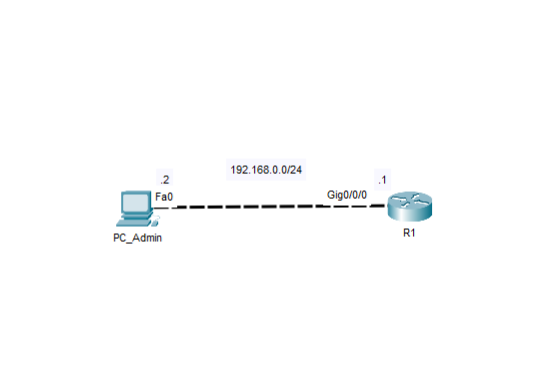

# Lab 01 - Initial Cisco Device Configuration

## Objective 
Perform the initial configuration of a Cisco device and prepare it for secure administartion and future network deployment.

## Topology

## Tecnologies
- Cisco Devices
- Cisco Ios
- Initial Configuration

## Verification
- show running-config
- show startup-config
- Ping Pc_admin to R1

## Key Takeaways
This lab reinforces the importance of performing a correttion initial configuration before deploying a Cisco device in a network.
A well-configured device is easier to manage, more secure, and ready for future implementations.
