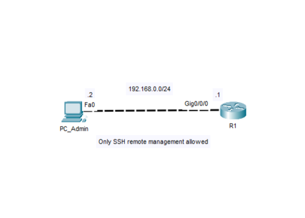

# Lab 02 - Secure Remote Device Management

## Objective 
Configure a Cisco device for secure remote administration by implementing local user authentication and SSH connetivity
 #### Prerequisites
 - Lab01 - Initial Cisco Device Configuration

## Topology

## Technologies
- Cisco Devices
- Cisco IOS
- Secure Remote Administration

## Verification
- show running-config
- show startup-config
- show ip ssh
- SSH connection from PC_Admin
- Verify that Telnet access is diabled

## Key Takeaways
This lab reinforces the importance of securing remote access to a Cisco device. Implementing local authentication and SSH improves administrative security by protecting management sessions and preventing unauthorized access.
