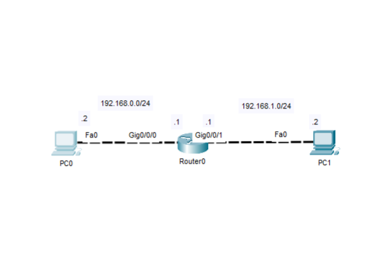

# Lab 03 - IPv4 Addressing and Basic Connectivity

## Objective 
Configure IPv4 addressing on a Cisco router and connected hosts to establish basic network connectivity between directly connect networks.

## Topology

## Tecnhologies
- Cisco Devices
- Cisco IOS
- Ipv4 Addressing
- Basic Connectivity

## Verification
- show running-config
- show startup-config
- show ip interfaces brief
- Show ip route
- Verify end-to-end connectivity (ping)

## Key Takeaways
This lab reinforces the importance of proper IPv4 addressing and basic network connectivity. Correct IP addressing, subnet configuration and default gateway assignament are essential for successful communication between directly connect networks and provide the foundation for more advanced routing tecnologies.
