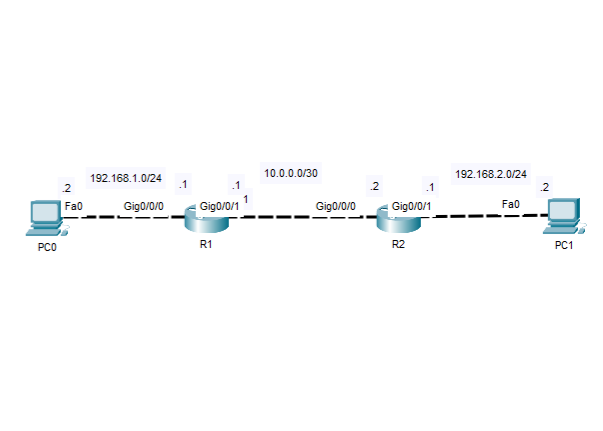

# Lab 04 - Static Routing

## Objective 
Configure static routes to enable communication between remote Ipv4 networks.

## Topology

## Tecnologies
- Cisco Devices
- Cisco Ios
- Ipv4 Addressing
- Static Routing

## Verification
- show running-config
- show startup-config
- show ip interfaces brief
- Show ip route (Verify presence "S" static routes)
- Verify end-to-end connectivity (ping)
- Verify end-to-end path (tracert)

## Key Takeaways
This lab higlights the need for static routing to enable communication between remote Ipv4 networks. Properly configured static routes alloe routers to forward traffic beyond directly connected networks end provide a solid foundation for implementing more advanced dynamic routing protocols.
