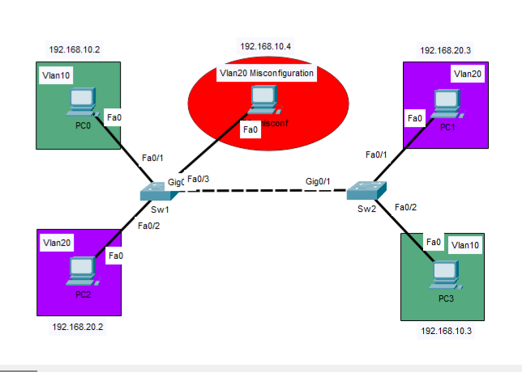

# Lab 05 - VLANs and IEEE 802.1Q Trunking

## Objective 
Configure Vlans and IEEE 802.1Q trunking to extend Layer 2 connectivity across multiple switches, implement Layer 2 security best practices and verify VLAN-based network segmentation.

## Topology

## Tecnologies
- Cisco Devices
- Cisco Ios
- VLANs
- IEEE 802.1Q Truniking
    #### Configuration Highlights
- Dedicated unused native VLAN
- Restricted Allowed VLAN list on teh trunk
- Intentional VLAN misconfiguration for connectivity testing
## Verification
- show running-config
- show startup-config
- show interfaces status
- show trunk interfaces
- show vlan brief
- Verify end-to-end connectivity (ping)
    - between host in the same VLAN
    - to the intentionally misconfigured host to verify VLAN isolation
## Key Takeaways
This lab demonstartes how VLANs logically segment Layer 2 networks and how IEEE 802.1Q trunking extends multiple VLANs across interconnected switches.It also reinforces Layer 2 security best practices and show how an incorrect VLAN assignment precents communication, even between hosts in the same IP subnet.
