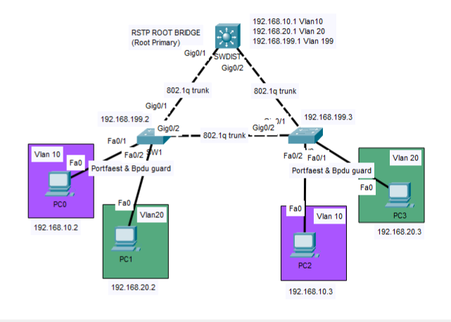

# Lab08 - Rapid PVST+ Best Practices

## Objective 
Implement a production-oriented Rapid PVST+ configuration by selecting an appropriate Root Bridge, optimizing Layer 2 forwarding paths, and securing edge ports using PortFast and BPDU Guard, the most relevant STP features supported by Cisco Packet Tracer.
#### Design Note
By default, Rapid PVST+ elected an access switch as the Root Bridge based on the Lowest Bridge ID. 
In this lab, the Distribution Switch is intentionally configured as the Root Bridge to create deterministic Layer 2 forwarding paths that better reflect an enterprise network design and simplify future troubleshooting.
PortFast and BPDU Guard are also configured on all access interfaces to provide faster edge-port convergence and protect against accidental switch connections. Although Cisco IOS commonly enables these features through global configuration, Cisco Packet Tracer does not consistently reproduce this behavior. For this reason, they are configured individually on each access interface troughout this lab. 
Root Guard and Loop Guard are intentionally omitted because their behavior cannot be consistently demostrated due to the limitations of the Cisco Packet Tracer environment.
#### Prerequisites 
Lab07 - Inter-VLAN Routing with Switch Virtual Interfaces (SVI)

## Topology

## Technologies
- Cisco Devices
- Cisco IOS
- Rapid PVST+
- PortFast
- BPDU Guard
  
## Verification
- show running-config
- show startup-config
- show spanning-Tree
- show spanning-Tree interfaces <interface> details
- show MAC address-table (confirm MAC learning and forwarding along the active Rapid PVST+ spanning tree)
- Verify end-to-end connectivity (ping)
## Key Takeaways
This lab reinforces the importance of Rapid PVST+ in preventing Layer 2 loops while maintaining a predictable network topology.
By manually selecting the Root Bridge and implementing PortFast and BPDU Guard on edge ports, I applied common enterprise best practices for both performance and security.
The configuration was validated through STP verification commands, MAC address table analysis, and Cisco Packet Tracer Simulation Mode to observe Layer 2 frame forwarding behavior.
