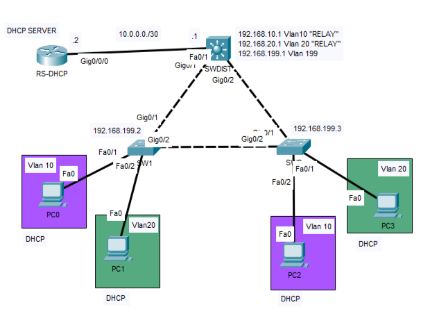

# Lab10 - DHCP Server and Relay Configuration

## Objective 
Design and implement a centralized DHCP solution using a Cisco router as a DHCP server and Layer 3 SVIs as DHCP relay agents.

The lab demonstrates dynamic IPv4 address assignment across multiple VLANs and verifies the Layer 3 reachability requirements between the DHCP server and relay agents.
#### Design Note
A dedicated Cisco router was configured as a centralized DHCP server, with separate DHCP pools for VLAN 10 and VLAN 20.

Since the DHCP server is located on a different subnet from the clients, the VLAN 10 and VLAN 20 SVIs on the distribution switch were configured as DHCP relay agents using ip helper-address. This allows client DHCP broadcasts to be forwarded to the remote DHCP server and enables the complete DORA process across Layer 3 boundaries.

The lab also verifies the role of the DHCP giaddr field. The relay inserts the address of the client-facing SVI into giaddr, allowing the DHCP server to identify the originating subnet and select the appropriate address pool.

Packet analysis in Cisco Packet Tracer also showed the relay using the corresponding SVI address as the source IP when forwarding the DHCP message toward the server.

To demonstrate the importance of bidirectional Layer 3 reachability, the DHCP process was initially tested without a return route from the DHCP server toward the client VLANs, causing the DHCP exchange to fail. A summarized static route (192.168.0.0/19) was then configured toward the relay, providing reachability to both VLAN 10 and VLAN 20 and allowing the DHCP process to complete successfully.
#### Prerequisites 
Lab07 - Inter-VLAN Routing with Switch Virtual Interfaces (SVI)

## Topology

## Technologies
- Cisco Devices
- Cisco IOS
- IPv4
- DHCP Server
- DHCP Relay
  
## Verification
- show running-config
- show startup-config
- show ip dhcp pool
- show ip dhcp binding
- show ip route
### Client verification
- ipconfig /all
- ipconfig /renew
## Key Takeaways
This lab demonstrates how centralized DHCP services can provide dynamic IP addressing across multiple network segments through the use of DHCP relay. It also highlights the requirement for proper Layer 3 reachability between the DHCP server and relay agents, particularly in this architecture, where the relay forwards DHCP messages using the client-facing SVI address rather than the address of the interface directly connected to the DHCP server.
