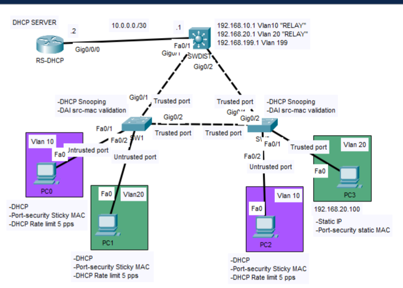

# Lab11 - Layer 2 Security

## Objective 
Design and implement a secure Layer 2 access infrastructure by combining Cisco security features that protect against rogue DHCP servers, DHCP starvation attacks, ARP spoofing, and unauthorized network access.

The lab demonstrates how multiple Layer 2 security mechanisms can work together to strengthen the access layer while maintaining normal network operation for authorized devices.
#### Design Note
DHCP Snooping was configured to allow DHCP messages only from trusted infrastructure ports while applying rate limiting on untrusted access ports to mitigate DHCP starvation attacks. Dynamic ARP Inspection was then implemented using the DHCP Snooping binding table to validate ARP traffic, providing protection against ARP spoofing attacks.

During the implementation, particular attention was required regarding DHCP Option 82 (Relay Agent Information Option). When DHCP Snooping is enabled, access switches may insert Option 82 information into forwarded DHCP messages. Depending on the relay agent or DHCP server configuration, these packets may be accepted, ignored, or rejected. Since Option 82 was not required for this laboratory, it was disabled on the access switch to maintain interoperability with the existing DHCP relay implementation.

Port Security was configured using a maximum of one secure MAC address per access port. Sticky learning was used for dynamically addressed hosts, while the statically configured host was secured using a manually configured secure MAC address. The restrict violation mode was selected to block unauthorized devices while preserving normal operation for legitimate hosts and providing visibility of security violations.

As part of the Layer 2 hardening process, all unused switch interfaces were administratively disabled and assigned to an unused VLAN (VLAN 99), reducing the attack surface and preventing unauthorized network access.
#### Prerequisites 
Lab10 - DHCP Server and Relay Configuration

## Topology

## Technologies
- Cisco Devices
- Cisco IOS
- IPv4
- DHCP Server
- DHCP Relay
  
## Verification
- show running-config
- show startup-config
- show DHCP pool
- show DHCP binding
- show ip route
### Client verification
- ipconfig /all
- ipconfig /renew
## Key Takeaways
This lab demonstrates how centralized DHCP services can provide dynamic IP addressing across multiple network segments through the use of DHCP relay. It also highlights the requirement for proper Layer 3 reachability between the DHCP server and relay agents, particularly in this architecture, where the relay forwards DHCP messages using the client-facing SVI address rather than the address of the interface directly connected to the DHCP server.

