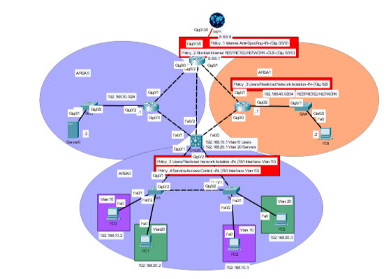

# Lab12 - Network Access Policies whit ACLs

## Objective 
Implement and verify network access policies using Standard and Extended ACLs within an existing OSPF multi-area topology, controlling communication between internal networks, access to specific services, and traffic to and from the Internet.

### Design Note
- **Policy 1** – Internet Anti-Spoofing
A Standard ACL was applied inbound on the Internet-facing interface to block traffic with source addresses belonging to the RFC1918 private address ranges. This provides basic anti-spoofing protection against packets entering the network with private source addresses that should not originate from the Internet.

- **Policy 2** – Restricted Network Internet Access
Internet access from the Restricted Network (192.168.40.0/24) was denied through a Standard ACL applied outbound on the Internet-facing interface. This placement ensures that only Restricted Network traffic actually leaving the infrastructure is blocked, without having to explicitly exclude the multiple internal networks that must remain reachable.

- **Policy 3** – Network Isolation
Communication between the Users network (192.168.10.0/24) and the Restricted Network (192.168.40.0/24) was denied in both directions. The policy was distributed across the gateways of both networks, filtering unauthorized traffic close to each source. This prevents packets that will ultimately be dropped from unnecessarily traversing the shared routed infrastructure. This approach also reduces dependency on a single filtering point: if one of the two ACLs were removed, the other would still prevent bidirectional communication from being successfully completed between the two networks. However, this does not provide complete redundancy, since unidirectional traffic could still reach the opposite network.

- **Policy 4** – Service Access Control
Access from the Users network (192.168.10.0/24) to the remote server was restricted to HTTP, HTTPS, DNS, and ICMP. All other traffic from the Users network toward the server is denied, while traffic not affected by this policy remains permitted.

- Stateful Firewall Consideration
No mirrored policy was implemented to specifically block connections initiated from the Internet toward the Restricted Network. In a typical enterprise architecture, this function would normally be handled by a stateful firewall at the network perimeter. A firewall is not implemented in this lab, as the focus is specifically on ACL-based policy enforcement.

- Stateless ACLs and Server Return Traffic
No mirrored ACL was implemented on the server side to filter return traffic toward the Users network. Traditional ACLs are stateless and do not maintain information about established sessions. Client-initiated connections normally use ephemeral source ports, which become destination ports in the server's return traffic. Therefore, a simple mirrored policy based on service ports cannot automatically identify legitimate return traffic. A stateful firewall, instead, maintains session state and can dynamically distinguish legitimate return traffic from newly initiated connections.

- ACL Testing and OSPF ECMP
To test Policy 1 – Internet Anti-Spoofing without adding additional external networks to the topology, loopback interfaces using RFC1918 private address ranges were configured on the router simulating the Internet. During tracert testing, non-intuitive hop sequences were observed due to OSPF ECMP paths with equal cost but different hop counts, which can cause successive probes to follow different paths. Despite this behavior, the test produced the expected result, confirming that the anti-spoofing policy was operating correctly.
  
#### Prerequisites 
Lab09 - OSPF Multi-Area Routing and Path Selection

## Topology
### Overall Topology

### Details Policies

## Technologies
- Cisco Devices
- Cisco IOS
- IPv4
- OSPFv2
- Named Standard/Extended ACLs
  
## Verification
- show running-config
- show startup-config
- show ip access-list
- show ip interface
- show ip route
- Verify end-to-end connectivity (ping)
- Path verification (traceroute)
  
## Key Takeaways
ACL placement and direction are as important as ACL configuration, as they determine where traffic is filtered and how efficiently security policies are enforced. Standard and Extended ACLs provide different levels of control: Standard ACLs filter traffic based on source addresses, while Extended ACLs allow more granular filtering based on source, destination, protocol, and service. Traditional ACLs are stateless and have limitations when applying mirrored controls to client-server traffic. In this lab, no ACL was implemented on the server side toward VLAN 10 because responses to client-initiated connections are directed to ephemeral ports that cannot be known in advance. A stateful control, as provided by a firewall, would instead dynamically allow traffic belonging to previously established sessions. When multiple security policies must be enforced on the same interface and in the same direction, their rules must be combined into a single ACL.

N.B. – Multipath Routing: In multipath environments, traceroute results require careful interpretation, as successive probes may follow different paths and produce non-intuitive hop sequences. Such behavior does not necessarily indicate a routing or connectivity issue; in this lab, despite the unusual traceroute output, traffic behavior and policy enforcement operated as expected.
