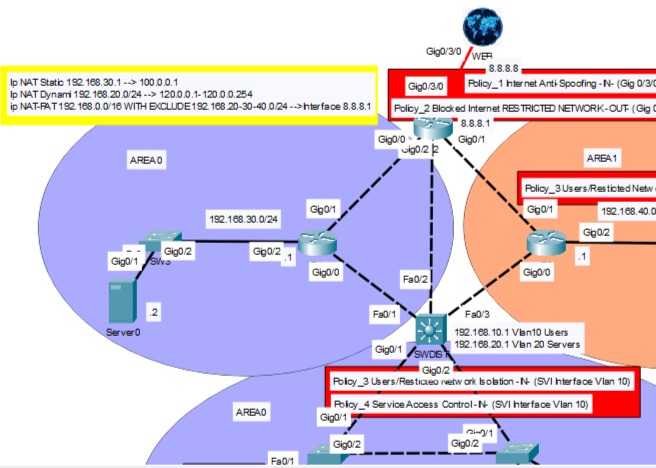

# Lab13 - IPv4 Address Translation - (NAT/PAT)

## Objective 
Implement and verify different IPv4 address translation mechanisms on the network edge, integrating Static NAT, Dynamic NAT, and NAT OVERLOAD/PAT into the existing network access policies.
The lab demonstrates how different internal networks can use different translation methods while maintaining clear and non-overlapping NAT classifications.

### Design Note
The topology builds upon Lab 12 – Network Access Policies with ACLs, preserving the previously implemented traffic policies while introducing IPv4 address translation on the Edge router.

Three different translation mechanisms were implemented:

- Static NAT maps Server0 (192.168.30.2) to a dedicated public address, providing a permanent one-to-one translation and allowing the server to be addressed from the outside through its Inside Global address.

- Dynamic NAT translates hosts belonging to the 192.168.20.0/24 Servers network using addresses dynamically allocated from a configured public address pool.

- PAT (NAT Overload) provides Internet translation for the 192.168.10.0/24 Users network, allowing multiple internal hosts to share the Edge router public address.

The 192.168.40.0/24 Restricted network is deliberately excluded from NAT classification, consistently with the Internet access restriction already implemented in Lab 12.

NAT classification was intentionally designed to avoid unnecessary overlapping matches. Networks associated with Static NAT, Dynamic NAT, or restricted access are explicitly excluded from the PAT classification. This makes the intended translation behavior immediately identifiable and improves configuration readability, troubleshooting, and future maintenance.

Descriptive ACL and NAT pool names are also used to make the relationship between traffic classification and translation policy easier to identify.

#### Prerequisites 
Lab12 - Network Access Policies with ACLs
## Topology

## Technologies
- Cisco Devices
- Cisco IOS
- IPv4
- Static NAT
- Dynamic NAT
- NAT Overload/PAT
- Named Standard ACLs for NAT Classification
  
## Verification
- show running-config
- show startup-config
- show ip access-list
- show ip interface
- show ip NAT translation
- show ip NAT statistics
- Generate traffic across NAT boundary to verify translation (ping)
  
## Key Takeaways
Static NAT provides a permanent one-to-one address mapping, Dynamic NAT assigns Inside Global addresses from a configured pool, while PAT allows multiple internal hosts to share a single public address.

NAT classification should be designed clearly and intentionally. In this lab, translation rules were kept non-overlapping to improve readability, predictability, troubleshooting, and maintainability.

NAT and network access policies serve different purposes: NAT provides address translation, while ACLs determine which traffic is permitted or denied. The Restricted network therefore remains explicitly blocked by the existing access policy and is also excluded from NAT classification.

