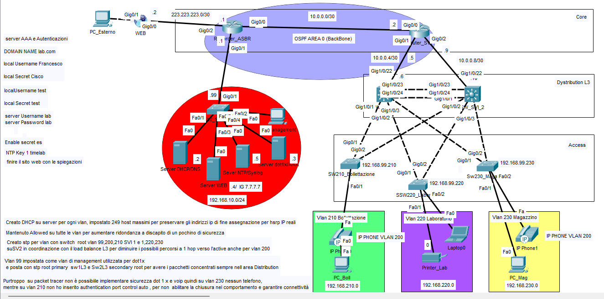
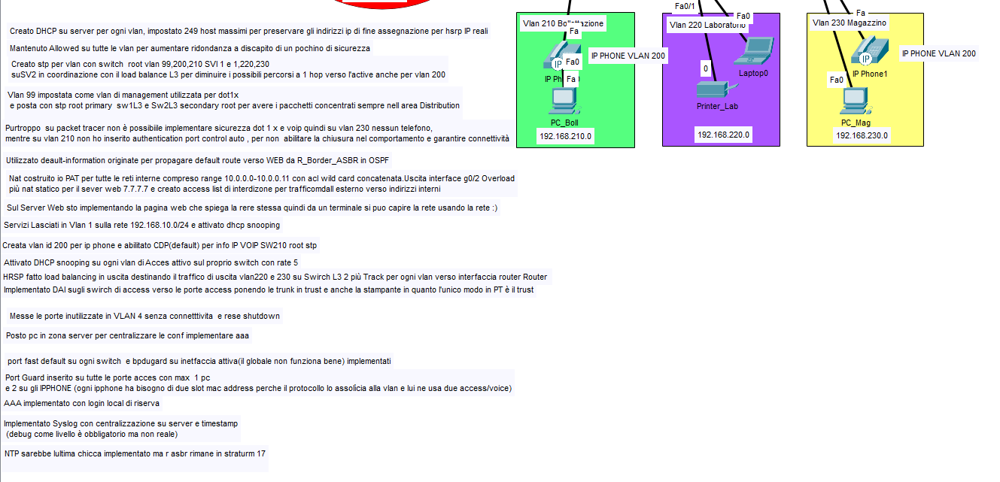
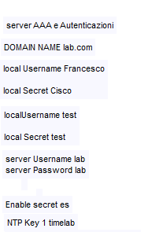

# Lab 19 – Progetto Enterprise Finale
Versione di lavoro

Questa è la versione di lavoro del progetto enterprise finale, pubblicata volutamente prima della fase di revisione, riorganizzazione e documentazione definitiva.

La rete è già stata progettata, implementata e resa operativa; questa versione mantiene però una struttura più grezza, vicina alla fase reale di progettazione e sviluppo, prima della successiva rifinitura destinata alla versione finale del portfolio.

Il progetto integra in un'unica infrastruttura numerose tecnologie e servizi affrontati durante il percorso di studio e laboratorio, tra cui VLAN e Voice VLAN, routing, SVI, HSRP, DHCP, DNS, servizi Web, NAT/PAT, ACL, sicurezza Layer 2, Port Security, DHCP Snooping, servizi di management e logging come NTP e Syslog, oltre ad altri meccanismi di connettività, ridondanza e sicurezza.

## Topologia e Bozza

### Topologia

### Bozza implementazioni

### Keys & Passphrase

